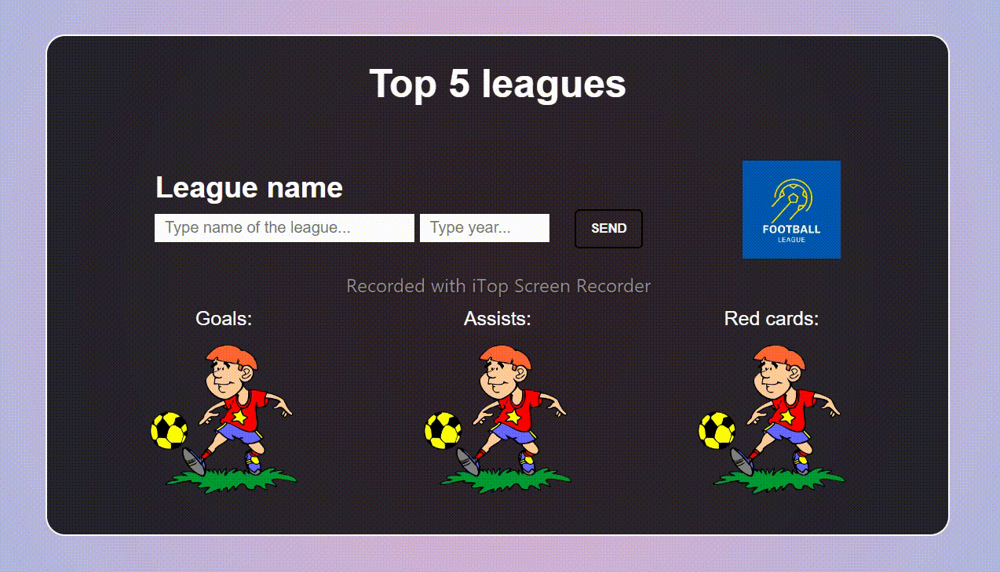

# Football-app

Project that shows some statistics from top 5 football leagues. You can type name of the league and year of the season.
If you did something wrong app would show error. In other case you would see: top goalscorer, top assist player and the player who got most number of red cards. 
Design isn't responsive because main goal was to practise js skills whit API.

### Final results: 

